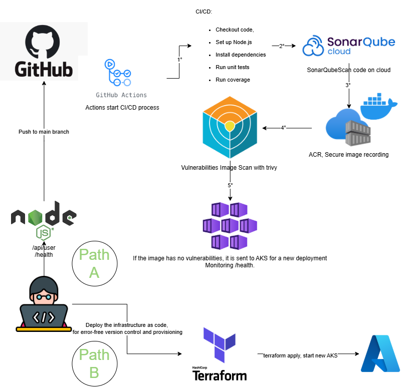
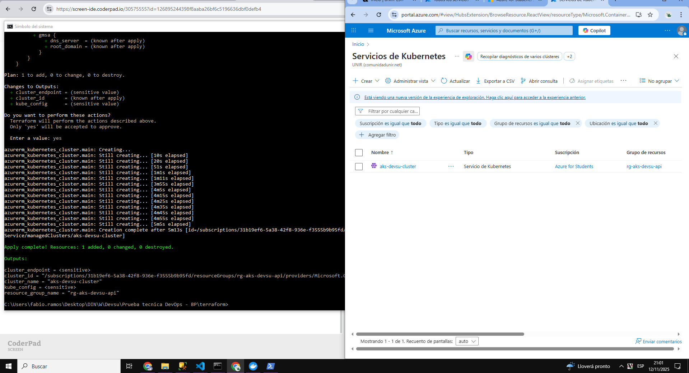
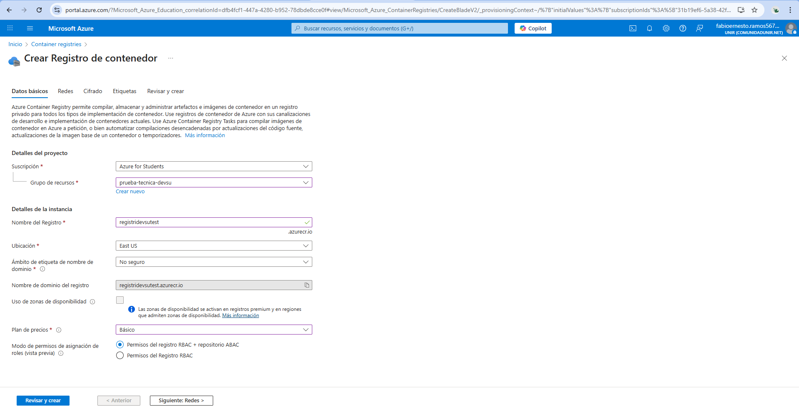

# Devsu technical test
The following technical test proposes 2 different flow paths.

### Path A
Triggered when the DevOps flow is launched and there are changes in the application.

This workflow covers different aspects, such as the first being CI/CD, then it moves on to code analysis with Sonar, thus guaranteeing its quality, in the third step the image is secured in an ACR thus having versions of each code, once the image is built in it the vulnerabilities are analyzed with Trivy, and if everything is okay the deployment is sent to the AKS with autoscaling.

### Path B
It is initially done to launch the IaC.

Triggered when you want to deploy the AKS safely at all times.

### Limitations in the test
I couldn't deploy from GitHub Actions because the Azure tenant I'm using wouldn't let me create the stored procedure, and I couldn't do it with direct authentication either, so I deployed it manually. However, the .github\deployment-render.yml file does work.

Link Sonar: [Open](https://sonarcloud.io/project/overview?id=fabio97U_Prueba-t-cnica-DevOps-BP)

### Thanks.